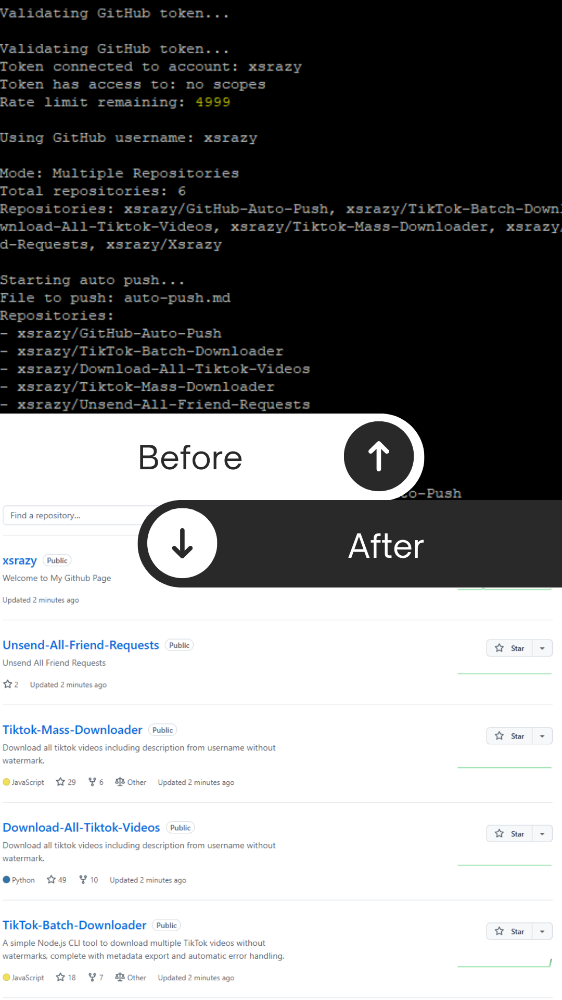

# GitHub Auto Push



Tool untuk auto push file ke GitHub repository dengan interval waktu tertentu. Mendukung mode single dan multiple repository.

Created by: [xsrazy](https://github.com/xsrazy)

## Fitur

- Dua mode operasi:
  - Single repository: Push ke satu repository
  - Multiple repositories: Push ke beberapa repository sekaligus
- Prompt interaktif untuk konfigurasi
- Pembuatan file otomatis
- Delay/jeda waktu yang dapat diatur
- Auto-push berkelanjutan
- Logging detail
- Konten file yang dapat dikustomisasi
- Template pesan commit dengan timestamp

## Prasyarat

- Node.js v14 ke atas
- Akun GitHub
- GitHub Personal Access Token dengan permission 'repo'

## Instalasi

1. Clone atau download repository ini
2. Masuk ke direktori:
   ```bash
   cd github-auto-push
   ```
3. Install dependencies:
   ```bash
   npm install
   ```

## Penggunaan

Jalankan script:
```bash
node push.js
```

### Mode Single Repository

1. Pilih "Single repository" saat diminta
2. Masukkan:
   - GitHub token
   - Username GitHub
   - Nama repository (contoh: "TikTok-Batch-Downloader")
   - Path file (default: auto-push.md)
   - Isi file
   - Template pesan commit
   - Delay dalam detik

Contoh output:
```
GitHub Auto Push
---------------
Created by: https://github.com/xsrazy

? Pilih mode repo: Single repository
? Masukkan GitHub token: (your_token)
? Masukkan username GitHub: xsrazy
? Masukkan nama repository: TikTok-Batch-Downloader
? Masukkan path file (default: auto-push.md): auto-push.md
? Masukkan isi file:
# Auto Push File
File ini akan di-push ke GitHub repository.
Terakhir diperbarui: {timestamp}

? Masukkan template pesan commit: 🤖 Auto Push Update {date}
? Masukkan delay dalam detik: 60

Mode: Single Repository
Memulai auto push...
File yang akan di-push: auto-push.md
Repository: xsrazy/TikTok-Batch-Downloader
Jeda waktu: 60 detik

Berhasil push auto-push.md ke TikTok-Batch-Downloader
Commit message: 🤖 Auto Push Update 2024-01-10 15:30:45
Menunggu 60 detik sebelum push berikutnya...
```

### Mode Multiple Repositories

1. Pilih "Multiple repositories" saat diminta
2. Masukkan:
   - GitHub token
   - Username GitHub
   - Nama repository (pisahkan dengan koma, contoh: "TikTok-Batch-Downloader, nextjs-geist-optimized-app, github-auto-push")
   - Path file (default: auto-push.md)
   - Isi file
   - Template pesan commit
   - Delay dalam detik

Contoh output:
```
GitHub Auto Push
---------------
Created by: https://github.com/xsrazy

? Pilih mode repo: Multiple repositories
? Masukkan GitHub token: (your_token)
? Masukkan username GitHub: xsrazy
? Masukkan nama repository (pisahkan dengan koma): TikTok-Batch-Downloader, nextjs-geist-optimized-app, github-auto-push
? Masukkan path file (default: auto-push.md): auto-push.md
? Masukkan isi file:
# Auto Push File
File ini akan di-push ke GitHub repository.
Terakhir diperbarui: {timestamp}

? Masukkan template pesan commit: 🤖 Auto Push Update {date}
? Masukkan delay dalam detik: 60

Mode: Multiple Repositories
Total repositories: 3
Repositories: TikTok-Batch-Downloader, nextjs-geist-optimized-app, github-auto-push

Memulai auto push...
File yang akan di-push: auto-push.md
Repositories:
- xsrazy/TikTok-Batch-Downloader
- xsrazy/nextjs-geist-optimized-app
- xsrazy/github-auto-push
Jeda waktu: 60 detik

Berhasil push auto-push.md ke TikTok-Batch-Downloader
Berhasil push auto-push.md ke nextjs-geist-optimized-app
Berhasil push auto-push.md ke github-auto-push
Menunggu 60 detik sebelum push berikutnya...
```

## Template Variables

- `{timestamp}` di isi file: Diganti dengan tanggal/waktu saat ini
- `{date}` di pesan commit: Diganti dengan tanggal/waktu saat ini

## Catatan

- Gunakan Ctrl+C untuk menghentikan auto-push
- Semua repository harus sudah ada sebelum menjalankan tool
- Isi file dan pesan commit yang sama digunakan untuk semua repo di mode multi
- File dibuat otomatis jika belum ada
- GitHub token harus memiliki akses 'repo'
- Delay maksimal 86400 detik (24 jam)

## Lisensi

MIT
